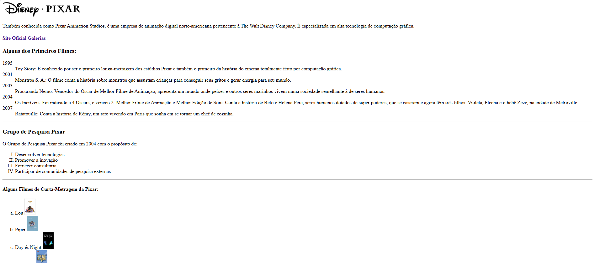
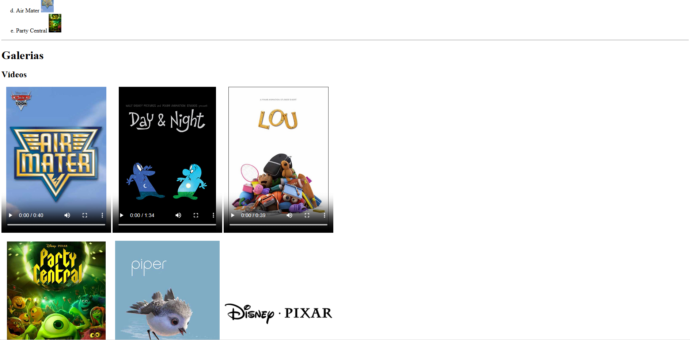
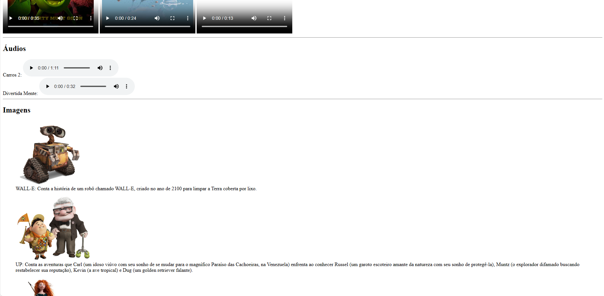
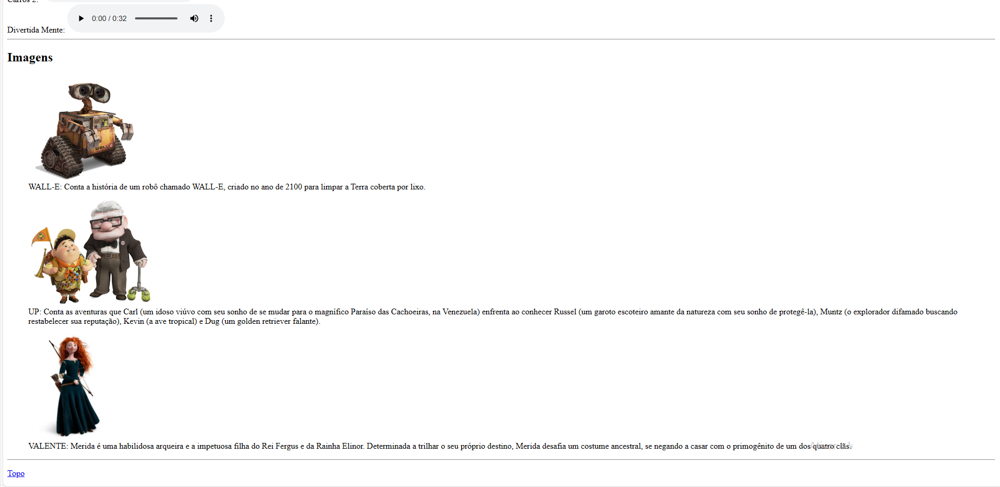

# atividadeHTML-Disney
uma das primeiras atividades de HTML feita em aula. html da disney. Aula do professor Rodrigo na Etec de Guarulhos.
  

  <h3>Bem simplão no começo do aprendizado de HTML</h3>
  

  

  <h3>Colocamos vídeos com capa</h3>
  

  

  <h3>Também teve áudios e imagens</h3>
  

  
